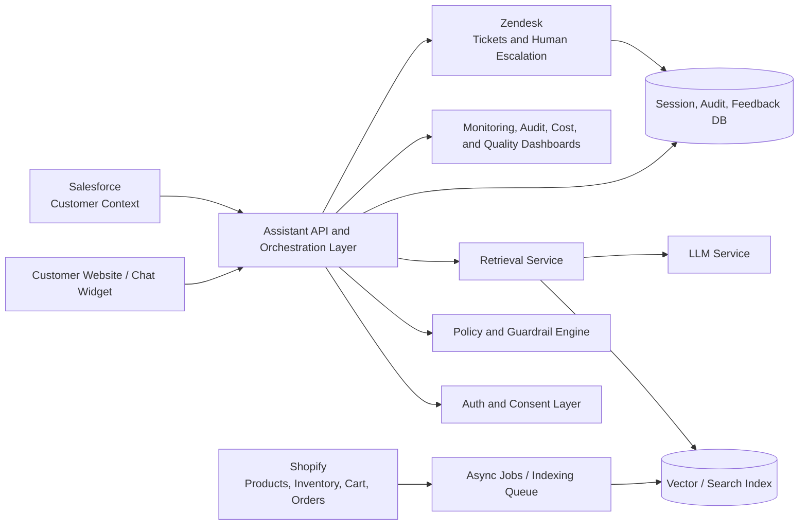

# 01 - Solution Proposal

## Executive Summary

I recommend launching the Customer Support and Product Discovery Assistant as a grounded, retrieval-based AI system that starts with website chat, Shopify product data, support knowledge, and Zendesk escalation.

The first release should not try to automate every support workflow. It should focus on answering common product and policy questions accurately, recommending relevant products with clear grounding, and escalating uncertain or sensitive cases to human support with full context.

The architecture should use retrieval-augmented generation, not model memory alone. Product catalog, FAQs, policies, manuals, and selected support content should be indexed and versioned. The assistant should retrieve approved context first, then generate a response within strict guardrails. If it cannot find enough evidence, it should escalate instead of guessing.

This approach balances speed, accuracy, security, and operational control. It allows the client to launch value quickly while leaving room for returns, refunds, order tracking, deeper personalization, and additional channels in later phases.

## Recommended Architecture

### Key Components

| Component | Responsibility |
| --- | --- |
| Website assistant | Customer-facing chat interface for product discovery and support |
| API/orchestration layer | Manages sessions, auth, retrieval, LLM calls, escalation, and response formatting |
| Retrieval service | Finds relevant product, policy, FAQ, and manual content before generation |
| LLM service | Generates grounded, customer-friendly responses from retrieved context |
| Guardrail engine | Applies escalation rules, confidence thresholds, unsafe-topic handling, and policy boundaries |
| Shopify connector | Syncs product catalog and inventory updates; supports selected real-time lookups |
| Salesforce connector | Adds customer context where authorized and useful |
| Zendesk connector | Creates tickets for low-confidence, sensitive, or complex support cases |
| Observability layer | Tracks latency, cost, errors, escalations, answer quality, and audit trails |

## AI and Data Strategy

The assistant should use retrieval-augmented generation for MVP.

RAG is the right starting point because the client’s product, inventory, policy, and support content will change often. A fine-tuned model alone would not reliably reflect current product availability, pricing, return rules, or support policy changes.

### Data Sources

| Source | Usage |
| --- | --- |
| Shopify product catalog | Product descriptions, SKU metadata, availability, collections, prices |
| Shopify cart/browsing context | Product recommendation context |
| FAQs and policies | Returns, exchanges, shipping, warranty, payment, account support |
| Product manuals | Troubleshooting and product usage guidance |
| Zendesk historical tickets | Understanding common issues and escalation categories |
| Salesforce | Customer segment, loyalty tier, account context, where permitted |

### Grounding Approach

- Use semantic search for FAQs, manuals, policy pages, and support documentation.
- Use structured product search for SKU, category, price, inventory, and attributes.
- Store document source, version, timestamp, and content owner for traceability.
- Require answers to cite or internally reference retrieved sources.
- Escalate when retrieved context is missing, contradictory, stale, or low confidence.
- Keep prompt templates versioned and reviewed.

### Hallucination Controls

- The assistant should answer only from retrieved or approved business context.
- If evidence is insufficient, it should say it cannot confirm and offer escalation.
- Sensitive workflows such as refund approval, account access, payment disputes, and legal complaints should escalate.
- Production monitoring should sample conversations for groundedness, correctness, and escalation quality.

## Integration Approach

### Shopify

Shopify is the primary source for products and commerce context.

Recommended design:

- Use webhooks for product, inventory, and price changes.
- Use scheduled jobs for full catalog reconciliation.
- Index product metadata into search/vector storage.
- Cache high-read product data.
- Use real-time API calls only when freshness is essential, such as inventory or authenticated order context.

Fallback:

- If Shopify is unavailable, answer from cached product data but avoid claiming live inventory or price certainty.
- Show safe language such as “I can help with product details, but I cannot confirm current availability right now.”

### Salesforce

Salesforce should be used selectively for customer context.

Recommended design:

- Use Salesforce only for authenticated or authorized flows.
- Pull minimal required fields such as customer segment, loyalty tier, account status, and recent support/account history.
- Apply field-level access control.
- Avoid sending unnecessary PII to LLM prompts.
- Log access for audit.

Fallback:

- If Salesforce is unavailable, continue general product and policy support without personalization.

### Zendesk

Zendesk should remain the operational fallback and support system of record.

Recommended design:

- Create a ticket when the assistant has low confidence, detects a sensitive topic, or the customer asks for a human.
- Include conversation summary, customer intent, retrieved sources, confidence score, and recommended ticket category.
- Route tickets to the right queue based on issue type and customer segment.
- Use resolved tickets to improve knowledge content and evaluation sets.

## Scalability Design

The client requires support for 500,000+ monthly active users.

### Traffic Assumptions

- 500,000 monthly active users
- 20-30% of users interact with the assistant monthly
- 2-4 messages per assistant session
- Higher traffic during promotions, holidays, and product launches
- Peak traffic may be 5-10x normal hourly volume

### Design Targets

| Metric | Target |
| --- | ---: |
| p95 response latency for common questions | Under 2 seconds |
| Availability | 99.9% |
| API error rate | Under 0.1% |
| MVP automation rate | 70-80% of common support questions |
| Mature automation rate | 90-95% after tuning |
| Critical security incidents | 0 |

### Scaling Approach

- Keep API services stateless and horizontally scalable.
- Cache common retrieval results and product metadata.
- Use async queues for indexing, feedback processing, analytics, and retries.
- Use rate limits to protect the system and downstream APIs.
- Separate interactive request paths from background jobs.
- Monitor token usage and cost per conversation.
- Use smaller models for classification, routing, and summarization where possible.

## Security, Governance, and Compliance

Security should be part of the architecture from the start.

### Data Protection

- Encrypt data in transit with TLS.
- Encrypt data at rest across databases, logs, object storage, and vector stores.
- Mask or avoid logging PII.
- Apply data retention rules for conversations and derived analytics.
- Use least-privilege access for integrations and admin tools.

### Privacy and Compliance

- Support GDPR and CCPA rights such as data access and deletion.
- Track where customer data is used.
- Minimize PII sent to model providers.
- Maintain audit logs for data access, prompt changes, knowledge-base changes, and admin actions.

### AI Governance

- Version prompts, model configurations, and indexed knowledge sources.
- Review high-risk prompt or policy changes.
- Maintain evaluation datasets for regression testing.
- Monitor hallucination rate, escalation rate, unsafe responses, and customer feedback.

## Technology Decisions

| Area | Recommendation | Rationale |
| --- | --- | --- |
| Cloud | Use client’s existing AWS or GCP standard | Reduces operational friction and security review effort |
| AI approach | RAG-first architecture | Best fit for frequently changing product and policy data |
| LLM | Managed enterprise LLM provider | Faster MVP and less infrastructure burden than self-hosting |
| Vector/search | Managed vector store or OpenSearch/pgvector | Supports semantic and hybrid retrieval |
| Database | PostgreSQL | Reliable for sessions, audit metadata, configs, and feedback |
| Cache | Redis | Low-latency access to common product and policy data |
| Queue | SQS/Pub/Sub equivalent | Decouples indexing, sync, analytics, and retries |
| Observability | Cloud-native monitoring plus Datadog/New Relic if already used | Gives engineering and operations teams production visibility |

## Key Tradeoffs

### RAG vs Fine-Tuning

Decision: Use RAG first.

Rationale: Product and policy information changes frequently. RAG keeps answers tied to current approved data. Fine-tuning can be considered later for tone, routing, or classification if there is evidence it adds value.

### Real-Time APIs vs Batch Sync

Decision: Use a hybrid model.

Rationale: Product catalog and policy documents can be indexed through batch sync and webhooks. Inventory, cart, and order state may need real-time calls. This keeps latency low without sacrificing freshness where it matters.

### Automation vs Customer Trust

Decision: Use conservative escalation during MVP.

Rationale: A wrong answer about refunds, payments, or account access can damage trust. The system should escalate more often at launch and become more automated as quality improves.

### Single Provider vs Multi-Provider

Decision: Start with one enterprise-ready LLM provider, but keep the orchestration layer provider-agnostic.

Rationale: Multi-provider support adds complexity during MVP. Designing clean boundaries preserves future flexibility.

## MVP Recommendation

The first release should include:

- Website assistant for product and support Q&A
- Shopify product and catalog grounding
- Zendesk escalation
- Basic product recommendations
- Limited Salesforce context where authorized
- Conversation audit logs
- Answer quality review workflow
- Dashboards for latency, errors, cost, escalation, and accuracy

The first release should defer:

- Full returns/refunds automation
- Autonomous order changes
- Multi-channel support
- Deep personalization
- Voice or social integrations

## Conclusion

The safest and most valuable path is to launch a focused, grounded, observable assistant that improves common customer support and product discovery while keeping humans in the loop for sensitive or uncertain cases.

This design gives the client early value, protects customer trust, and creates a strong foundation for more advanced AI workflows after the MVP is proven in production.
